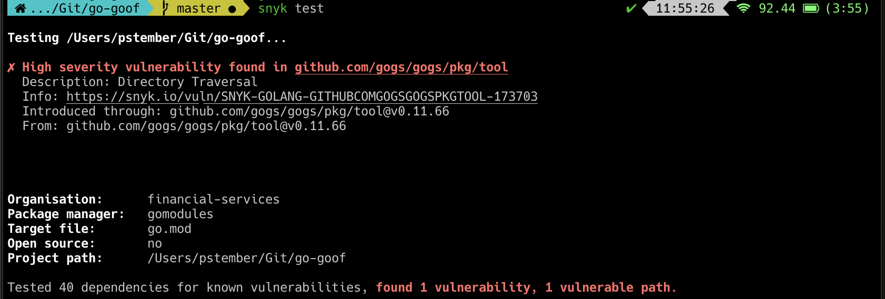

# Go Goof

1. Open a terminal and clone the repository

    ```console
    git clone git@github.com:pstember/go-goof.git
    ```
and open the `go-goof` directory.

2. Build the project

   ```console
   go install //This will move the executable to the bin folder where it will be found to be executed
   ```

3. Test the project

   ```console
   snyk test
   ```

All-in-one to clone and run:

```console
git clone git@github.com:pstember/go-goof.git && \
cd go-goof && \
go install && \
snyk test
```

## Screenshots

The following screenshot demonstrates the extra value provided when scanning a
project using the Snyk CLI tool

### Vulnerability detection

This screenshot shows vulnerabilities and potential remediation when such remediation exist



# Installing Go
```console
export GOPATH="${HOME}/.go"
export PATH="$PATH:${GOPATH}/bin:${GOROOT}/bin"
test -d "${GOPATH}" || mkdir "${GOPATH}"
brew install go
```
Don't forget to update your `.bashrc` or `.zshrc`
